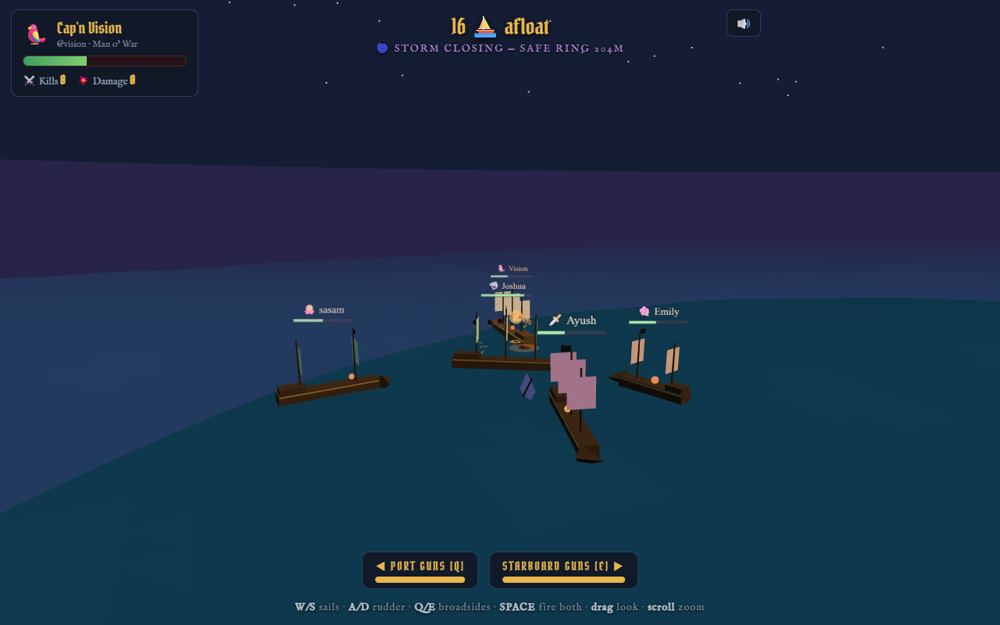
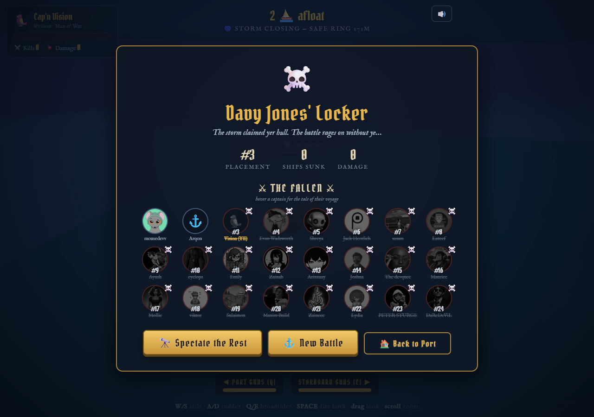
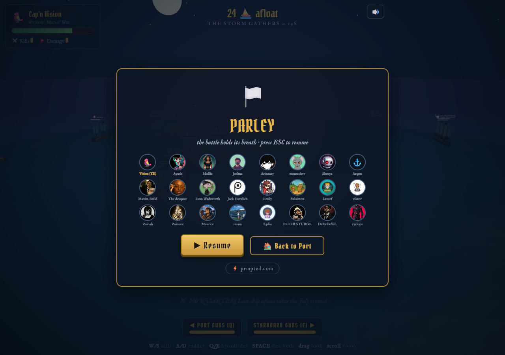

# ⚓ BROADSIDE ROYALE

**A 3D pirate battle royale starring the Prompted community.**
Built for the [Prompted](https://prmpted.com) July 2026 Games Contest.

▶️ **[PLAY IT IN YER BROWSER](https://bitmousekatze.github.io/JulyContest/)** — no install, no build, just wind and gunpowder.



Pick a real community member as your captain, then sail into an open ocean
arena against **all 23 other captains from the Prompted leaderboard** —
live cannon fire, a closing storm, one crown. Last ship afloat wins.

## How it works

- **Choose yer Captain** — the roster is the real Prompted leaderboard
  (top 24 by Builder Points, pulled 2026-07-12), real avatars included.
- **Two modes** — **⚖️ Fair Seas** (default): every captain sails the same
  Galleon with the same reload and aim — Builder Points grant no combat
  perks, pure seamanship decides. **⚜ Builder's Might**: the classic mode —
  top 8 by BP sail a Man o' War (5 guns/side, tanky, slow), middle 8 a
  Galleon, the rest a nimble Brigantine; higher BP also means faster
  reloads and truer aim. Each mode has its own high-score leaderboard.
- **Free naval combat** — broadsides fire from your ship's sides, cannonballs
  fly a real ballistic arc, and accuracy falls off hard with distance. Close
  in for a killing volley, or kite at range and dodge.
- **The storm** — after a 20s grace the purple storm ring closes in. Sail
  outside it and your hull burns; once it reaches the maelstrom, all waters
  are cursed. There is always exactly one survivor.
- **Kill feed & spectate** — watch the community sink each other in real
  time; if you go down, spectate the rest of the battle or restart.
- **The Fallen** — the end screen shows a Hunger Games-style memorial of
  all 24 captains with their real Prompted avatars: who survived, who sank,
  their placement, and (on hover) kills, damage, hull, and who sank them.
- **ESC to parley** — pauses the battle over a mini roster board, with a
  link back to [prmpted.com](https://prmpted.com). Click any captain on a
  roster board to visit their real prmpted profile.
- **prmpted Games integration** — the prmpted SDK is wired in: **15
  achievements** (+15 BP each on the platform) and a global **high-score
  leaderboard**. Score = kills ×150 + damage dealt + placement bonus +
  seconds survived, submitted at the end of every run.

### Achievements

| ID | How |
|---|---|
| `first_blood` | Sink yer first ship |
| `gunslinger` | 3 ships sunk in one battle |
| `fleet_admiral` | 5 ships sunk in one battle |
| `deadeye` | Killing volley from beyond 55m |
| `underdog_upset` | Sink a Man o' War from a Brigantine (Builder's Might mode) |
| `broadside_maestro` | Every ball of one volley hits the same ship |
| `last_ship_afloat` | Win a royale |
| `close_shave` | Win with hull under 10% |
| `pacifist_podium` | Place top 5 without sinking anyone |
| `davy_jones_locker` | Get sunk (it happens to the best) |
| `kraken_bait` | Get swallowed by the storm |
| `storm_chaser` | Survive 8+ seconds inside the storm |
| `boarding_party` | Bump hulls with another ship |
| `sea_dog` | Fight 10 battles |
| `spyglass` | Spectate a battle to its bitter end |

| The Fallen | Parley (pause) |
|---|---|
|  |  |

## Controls

| Input | Action |
|---|---|
| `W` / `S` | more sail / slow & reverse |
| `A` / `D` | rudder port / starboard |
| `Q` | fire port broadside |
| `E` | fire starboard broadside |
| `SPACE` | fire both sides |
| `ESC` | pause (parley) |
| drag mouse | look around |
| scroll | zoom |

## Run it locally

Clone and open `index.html` in a browser — that's it. No build step.
Three.js loads from CDN, so you need an internet connection.

## Files

| File | What |
|---|---|
| `index.html` | Page shell, HUD, and all styling |
| `game.js` | Three.js scene, simulation, AI, and effects |
| `roster.js` | The community roster — **edit this** to add/remove captains |
| `BattleSong.mp3` | Battle music (non-copyrighted) — loops during the arena, 🔊 mutes |

## Editing the roster

Open `roster.js` and add a line:

```js
{ username: "newmember", name: "New Member", emoji: "🦀", bp: 1200, avatar: null },
```

`bp` (Builder Points) controls their hull class, reload speed, and aim.
`avatar` is an optional image URL for the memorial board.

## Tuning the battle

All pacing knobs live at the top of `game.js`: hull HP/speed in `HULLS`,
cannonball damage in the ball-hit branch of `step()`, storm timing in
`STORM`, and accuracy falloff in `fireBroadside()`. Match pacing was tuned
by running full headless AI-only battles via the `window.__broadside`
debug hook (start / step / state) — handy if you want to rebalance.

---

*Built with [Claude Code](https://claude.com/claude-code) for the Prompted July Games Contest.* 🏴‍☠️
